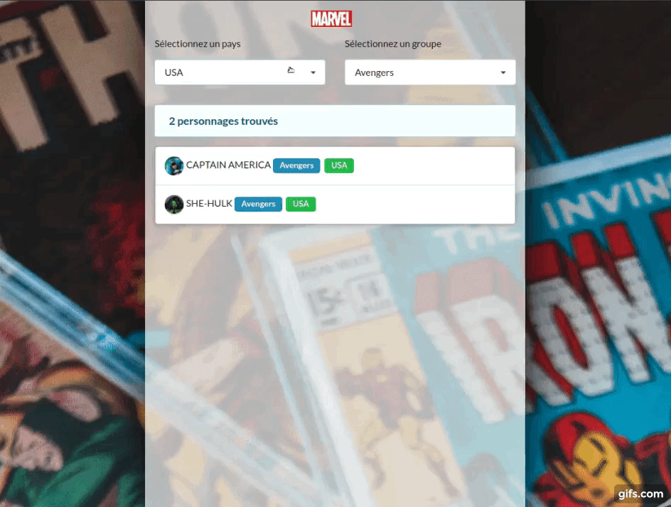

# Marvel Characters Finder

Single page app that makes it possible to find Marvel Characters by origin country.

The characters are sort by country and by group (X-men, Avengers, etc... 

This app was build with **REACT JS**.
The styles were build with **Semantic UI** framework.

# Getting Started with React App Model (custom)

This project was bootstrapped with an App Model Custom

## Available Scripts

In the project directory, you can run:

### `yarn start`

Runs the app in the development mode.\
Open [http://localhost:8080](http://localhost:8080) to view it in the browser.

The page will reload if you make edits.
